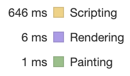
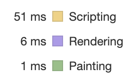
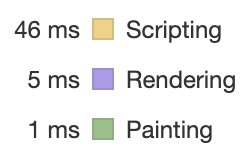
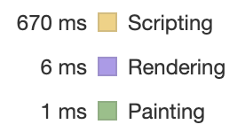
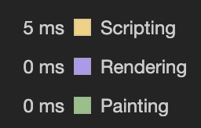

# TodoList

## Info

- [리액트를 다루는 기술](https://search.daum.net/search?w=bookpage&bookId=5056576&tab=introduction&DA=LB2&q=%EB%A6%AC%EC%95%A1%ED%8A%B8%EB%A5%BC%20%EB%8B%A4%EB%A3%A8%EB%8A%94%20%EA%B8%B0%EC%88%A0) 도서를 공부하면서 진행한 실습 예제입니다.

## Install

```bash
yarn
```

## Run (development mode)

```bash
yarn start
```

## Build

```bash
yarn build
```

## Component Optimization

- before

  

- memo + useState 함수형 업데이트 적용

  

- memo + useReducer 적용

  

### Component Optimization 결론 (개인 생각)

- 기존 코드 대부분을 변경해야하는 단점이 있지만 전반적으로 코드가 깔끔하게 정리된 느낌을 주는 useReducer 방식이 더 깔끔한 것 같다. 이미 useState로 구현되어 있는 경우 실질적으로 성능 차이가 없기 때문에 구지 useReducer 형태로 변경할 이유는 없을 것 같다.

- 이번 프로젝트의 경우 memo만 적용할 경우 큰 성능적인 차이를 느낄 수 없었습니다.

  

## Rendering Optimization

- before

  

- virtualized 적용

  

### Rendering Optimization 결론 (개인 생각)

- 2500개 데이터를 전부 출력하기 보다는 화면 출력될 크기를 지정하고 그 크기만큼만 보여주는 `react-virtualized`의 `List`컴포넌트를 통해 최적화 작업을 진행했습니다.

- 보여주는 개수가 적어 화면을 갱신해야하는 요소가 줄어들면서 Rendering 뿐만 아니라 Scripting 작업도 줄어드는 것을 볼 수 있었습니다.

- 이 부분에 대해서 여러 프로젝트에 적용할 수 있을 것이라 판단했습니다.
